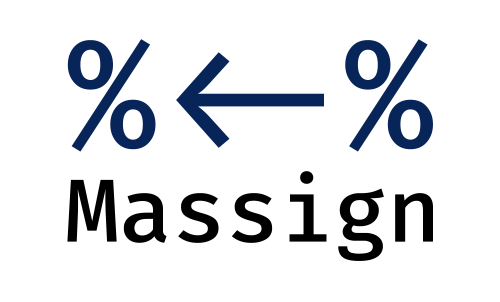

<p align="center">
  </img>
  <br>
  <h4 align="center">Simple matrix construction in R</h4>
  <p align="center">
    <a href="https://travis-ci.org/vankesteren/Massign"></a>
    </a>
  </p>
</p>
<br>

### What is this?
An `R` package with a single function: the matrix assignment operator `%<-%`.

### Why is this?
What's simpler:

```R
# let's create a correlation matrix!
M <- matrix(c(1, 0.2, -0.3, 0.4,
              0.2, 1, 0.6, -0.4,
              -0.3, 0.6, 1, 0.4,
              0.4, -0.4, 0.4, 1),
            nrow = 4,
            ncol = 4,
            byrow = TRUE)
```
or

```R
# Showing off the lower triangular feature:
M %<-% "   1
         0.2,    1
        -0.3,  0.6,    1
         0.4, -0.4,  0.4,    1"
```

I like the second better. Hence `Massign`.

### How do I install it?
```R

devtools::install_github("vankesteren/Massign")
library(Massign)
```

### Can you give a more formal description?
Constructing matrices for quick prototyping can be very annoying in
R, requiring the user to think about how to fill the matrix with values using
the matrix() function. The `%<-%` operator solves that issue by allowing the user
to construct string matrices that look like actual matrices.

### FAQ
#### Why the choice for `%<-%`?
R users may already be used to the other matrix operations like `%*%` and `%^%`
(from `expm`). I felt this was a logical choice in that context.

#### What else can the package do?
```R
#' @examples
# Basic usage
M %<-% "   1,  0.2, -0.3,  0.4
        0.2,    1,  0.6, -0.4
       -0.3,  0.6,    1,  0.4
        0.4, -0.4,  0.4,    1"

# Variables allowed!
phi <- 1.5
V %<-% "1,     1,     1
        1,   phi, phi^2
        1, phi^2, phi^4"

# We can also assign to the right:
"   1
  0.5,   1
 -0.2, 0.2,   1" %->% S

# Complex matrices work too:
C %<-% "  1+2i, 2+1i, 3+4i
        4+0.5i, 5+2i, 6+4i"
```

#### Who is the target audience?
Anyone who uses `R` for prototyping with matrices. For example, generating data with `lavaan` can be made easier using `Massign`, or trying out different matrix operations.
**NB: Massign` is _not_ for programming**. Due to the way the assignment operator `%<-%` currently works, I do not guarantee it to work once environments become a little more difficult. **Use of this package as a dependency is at your own risk :)**

#### How did you make that arrow in the logo?
That's the font [Fira Code](https://github.com/tonsky/FiraCode), where `<-` is a ligature. Check it out!
